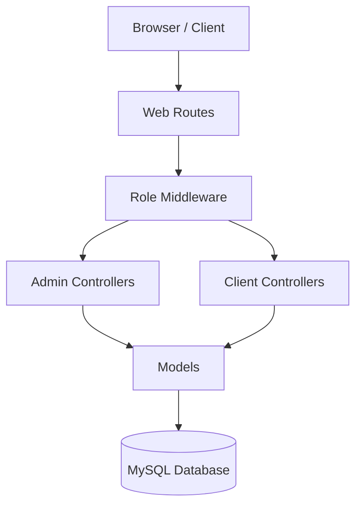

# System Architecture

## 1. High-Level Diagram
The system relies on a monolithic Laravel application structure with a MySQL database.

## 2. Database Schema (Key Entities)

### Core
-   `users`: Base user table.
-   `web_profiles`: Configuration for website branding (Logo, Contact, SEO).
-   `menus`: Dynamic menu management.

### Locations (Admin Managed)
-   `provinces`: Top-level locations (Cities/Provinces).
-   `districts`: Sub-level locations.
-   `stops`: Specific physical locations (Bus stations, offices).
-   `routes`: Generic connection between two Provinces (e.g., Hanoi -> Sapa).
-   `route_stops`: Ordered list of pickup/dropoff points per route.

### Transport (Admin Managed)
-   `buses`: Fleet vehicles owned by the system.
-   `bus_services`: Amenities (Wifi, AC, etc.).
-   `trips`: **Schedules** connecting a `bus` to a `route` with `start_time`, `end_time`, and `price`.

### Booking
-   `bookings`: Connects `user` (optional) to `trips`.
    -   Tracks `pickup_stop_id`, `dropoff_stop_id`.
    -   Statuses: `pending`, `confirmed`, `cancelled`, `completed`.

## 3. Key Relationships

-   **Route <-> Trip:** 1-to-Many. One route can have multiple trips (schedules).
-   **Bus <-> Trip:** 1-to-Many. One bus can serve multiple trips over time.

## 4. Security & Access Control
-   **Admin Access:** Full CRUD on master data (`provinces`, `routes`, `buses`, `trips`) and oversight of all bookings.
-   **Customer Access:** Read-only on Routes/Schedules. Write access to `bookings` (creation) and `users` (own profile).
