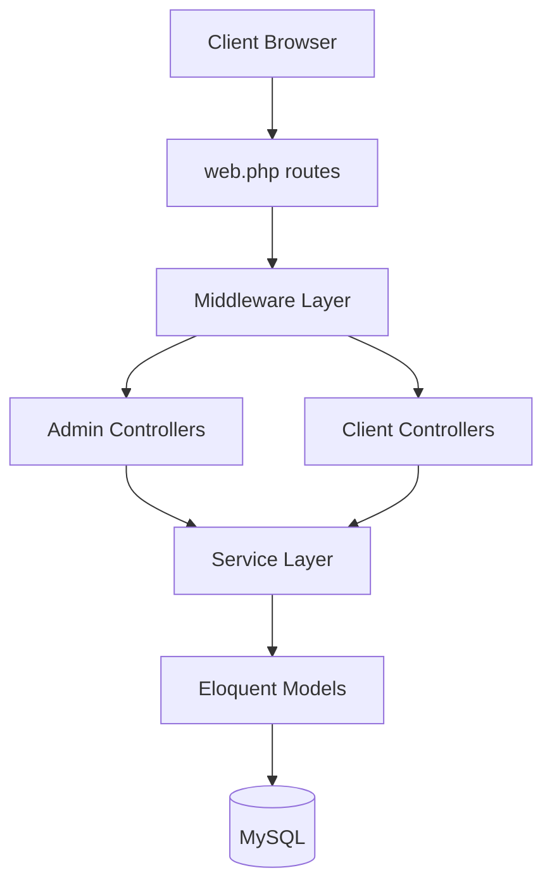
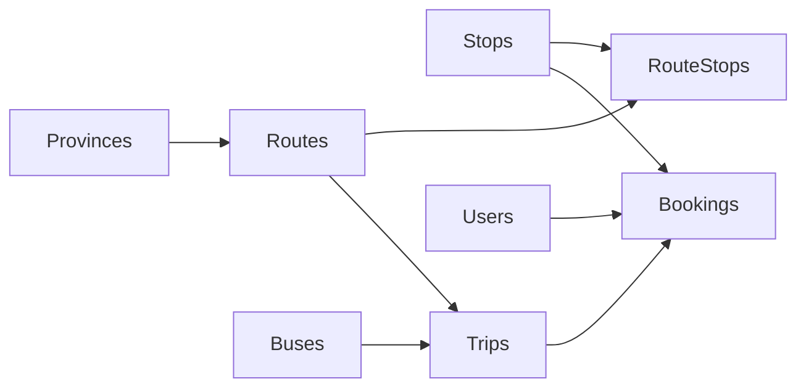

# System Architecture

## 1. High-Level Architecture

KingExpressBus uses a monolithic Laravel application with Blade-based server rendering and a MySQL database.

## 2. Current Runtime Data Model

### 2.1 Core Business Flow

### 2.2 Key Domain Notes

- `trips` is the active schedule table.
- `bookings.trip_id` links booking to a trip.
- `route_stops` is the active route-stop mapping.
- Holiday pricing uses `holiday_surcharges` (global by date range) and `holiday_surcharge_routes` (route-level additive surcharge).
- Client-facing prices are resolved as effective price (base trip price + applicable surcharge).
- Multi-tenant company-oriented tables were removed in the single-tenant refactor migration.

## 3. Complete Database Table Catalog

This section lists all known tables from migration history, separated by active vs legacy state.

### 3.1 Active Tables (Current Schema)

Framework/system/auth:
- `migrations`
- `users`
- `password_reset_tokens`
- `sessions`
- `cache`
- `cache_locks`
- `jobs`
- `job_batches`
- `failed_jobs`
- `personal_access_tokens`

Application/business:
- `web_profiles`
- `menus`
- `provinces`
- `district_types`
- `districts`
- `stops`
- `routes`
- `route_stops`
- `bus_services`
- `buses`
- `trips`
- `bookings`
- `holiday_surcharges`
- `holiday_surcharge_routes`

### 3.2 Legacy Tables (Historical / Dropped In Current Runtime)

- `companies`
- `company_routes`
- `company_route_stops`
- `bus_routes`

## 4. Relationship Map (Active Tables)

- `districts.province_id` -> `provinces.id`
- `districts.district_type_id` -> `district_types.id`
- `stops.district_id` -> `districts.id`
- `routes.province_start_id` -> `provinces.id`
- `routes.province_end_id` -> `provinces.id`
- `route_stops.route_id` -> `routes.id`
- `route_stops.stop_id` -> `stops.id`
- `trips.bus_id` -> `buses.id`
- `trips.route_id` -> `routes.id`
- `holiday_surcharge_routes.holiday_surcharge_id` -> `holiday_surcharges.id`
- `holiday_surcharge_routes.route_id` -> `routes.id`
- `bookings.user_id` -> `users.id` (nullable)
- `bookings.trip_id` -> `trips.id`
- `bookings.pickup_stop_id` -> `stops.id`
- `bookings.dropoff_stop_id` -> `stops.id`

## 5. Security & Access Boundaries

- Admin area: full CRUD for business tables and operation management.
- Client area: search/read for routes and trips, create bookings, update own profile.
- Middleware gates:
  - `App\Http\Middleware\AdminAuthMiddleware` (admin `/quan-tri`)
  - `App\Http\Middleware\Roles\CustomerAuthMiddleware` (client portal)

## 6. Source-Of-Truth Priority

When documentation conflicts are found:
1. Prefer migration files in `database/migrations`.
2. Then verify model fillable/casts and controller/service usage.
3. Treat SQL dump snapshots as potentially stale.
